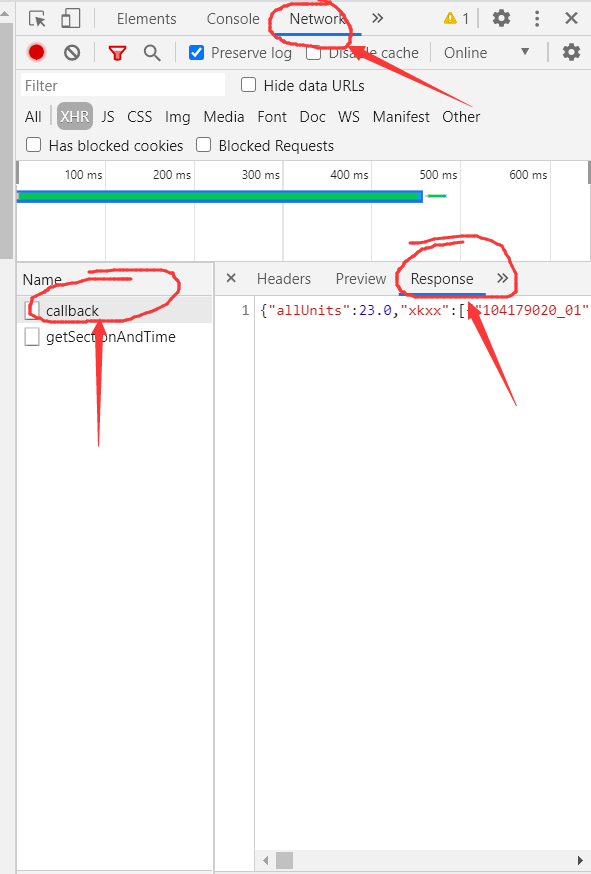

# 课表查看

---------------

- 要生成自己的课表，先需要去教务处复制一下响应，具体做法如下
1. 进入教务处的历年学期课表页面，按下键盘的f12，再选择相应的学期点查询，找到旁边network中XHR种的callback请求，再选择Response，复制Response下的文字。如图 
2. 进入[输入链接](https://2239559319.github.io/school/table/)输入复制好的文字点提交，就会生成课表了。

------------

> 先阶段只有一种主题颜色可选，后面的需求会加上更多的主题和颜色